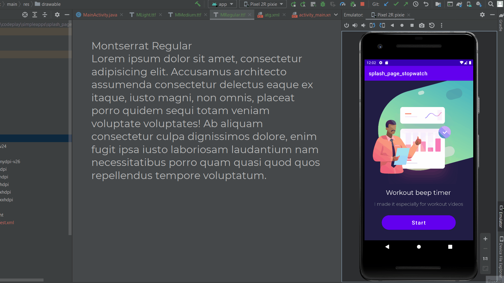
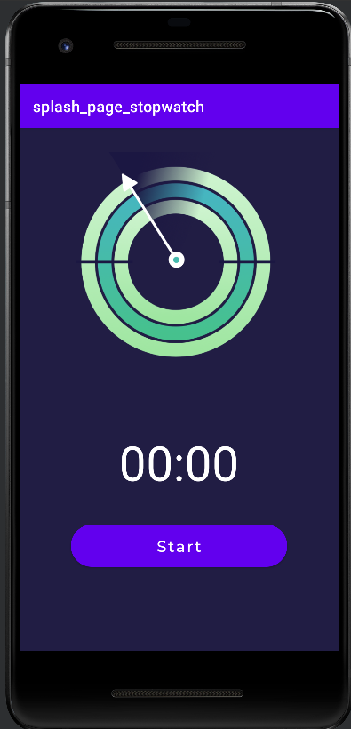
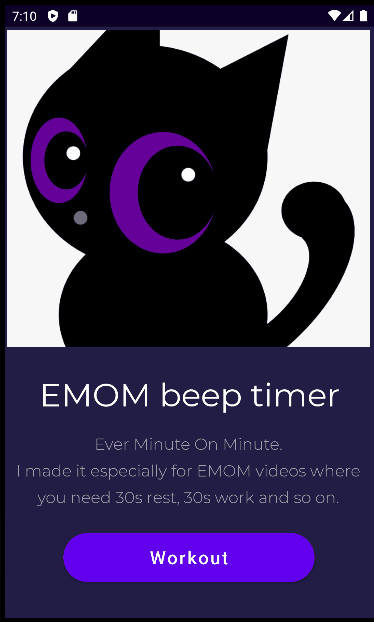
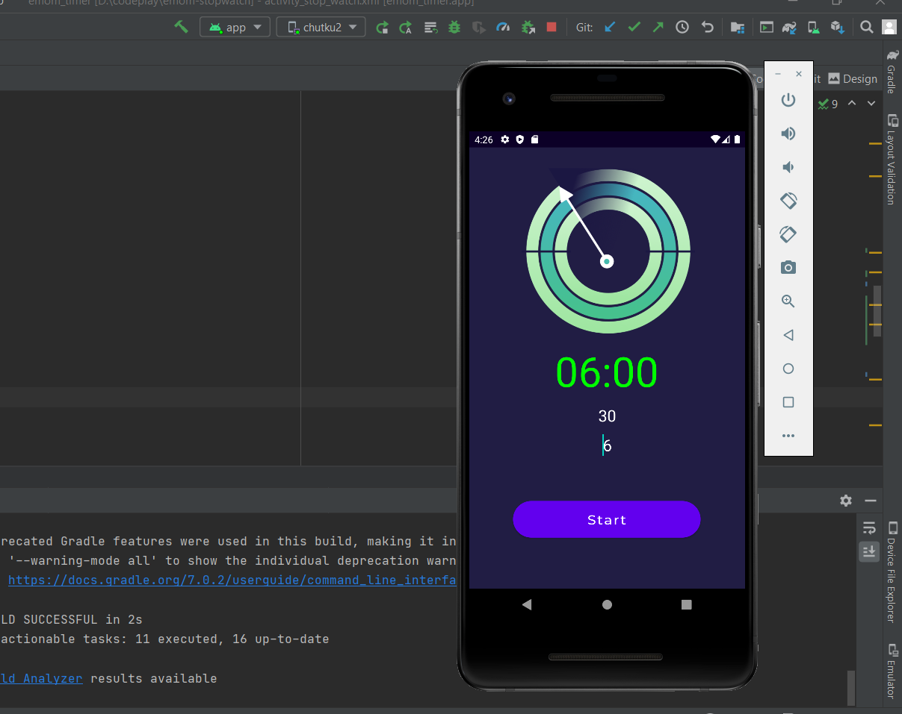

# Stop watch with splash page

https://www.youtube.com/watch?v=gqn7HqTnOPA

at 9.08 min

Completed splash page design animation



# Errors currently

1. https://stackoverflow.com/questions/30142056/error-unfortunately-you-cant-have-non-gradle-java-modules-and-android-gradle
delete .idea folder restart. and also wipe data from emulator and restart emulator.

2. https://stackoverflow.com/questions/23330816/error-package-android-support-v7-app-does-not-exist/57407028

Just needed to remove v7.compat line.
At 12.22.

Liquidate error first before continuing.

Tutorial finished


# Things to do

1. scale down the arrow of time - done 
2. look at the background - done
3. Change the UI - done
4. add a stop and reset button - done
5. very important add beep - beep added - done
6. logic for beep - done
7. input interval and timer set. - done

# Release 1.0



# current problems

App hangs after sometime due to

```
022-01-13 16:14:49.835 11909-11909/? W/_page_stopwatc: Accessing hidden field Ljava/lang/Thread;->threadInitNumber:I (greylist-max-o, linking, denied)
    java.lang.RuntimeException: Init failed
2022-01-13 16:14:49.845 11909-11909/com.example.splash_page_stopwatch W/_page_stopwatc: Accessing hidden method Ldalvik/system/DexPathList$Element;->access$000(Ldalvik/system/DexPathList$Element;)Ljava/lang/String; (blacklist, linking, denied)
        at android.media.ToneGenerator.native_setup(Native Method)
        at android.media.ToneGenerator.<init>(ToneGenerator.java:748)
2022-01-13 16:14:49.845 11909-11909/com.example.splash_page_stopwatch W/_page_stopwatc: Accessing hidden method Ldalvik/system/DexPathList;->getNativeLibraryDirectories()Ljava/util/List; (greylist-max-o, linking, denied)
        at com.example.splash_page_stopwatch.StopWatchAct$2.onChronometerTick(StopWatchAct.java:93)
2022-01-13 16:14:49.835 11909-11909/? W/_page_stopwatc: Accessing hidden field Ljava/lang/Thread;->threadInitNumber:I (greylist-max-o, linking, denied)
        at android.widget.Chronometer.dispatchChronometerTick(Chronometer.java:352)
        at android.widget.Chronometer$1.run(Chronometer.java:344)
2022-01-13 16:14:49.845 11909-11909/com.example.splash_page_stopwatch W/_page_stopwatc: Accessing hidden method Ldalvik/system/DexPathList;->initByteBufferDexPath([Ljava/nio/ByteBuffer;)V (blacklist, linking, denied)
        at android.os.Handler.handleCallback(Handler.java:938)
2022-01-13 16:14:49.835 11909-11909/? W/_page_stopwatc: Accessing hidden method Ljava/lang/Thread;->processQueue(Ljava/lang/ref/ReferenceQueue;Ljava/util/concurrent/ConcurrentMap;)V (greylist-max-o, linking, denied)
        at android.os.Handler.dispatchMessage(Handler.java:99)
        at android.os.Looper.loop(Looper.java:223)
2022-01-13 16:14:49.845 11909-11909/com.example.splash_page_stopwatch W/_page_stopwatc: Accessing hidden field Ldalvik/system/-$$Lambda$DexPathList$_CyMypnZmV6ArWiPOPB4EkAIeUc;->INSTANCE:Ldalvik/system/-$$Lambda$DexPathList$_CyMypnZmV6ArWiPOPB4EkAIeUc; (blacklist, linking, denied)
        at android.app.ActivityThread.main(ActivityThread.java:7656)
        at java.lang.reflect.Method.invoke(Native Method)
2022-01-13 16:14:49.835 11909-11909/? W/_page_stopwatc: Accessing hidden field Ljava/lang/Thread;->defaultUncaughtExceptionHandler:Ljava/lang/Thread$UncaughtExceptionHandler; (greylist-max-o, linking, denied)
2022-01-13 16:14:49.845 11909-11909/com.example.splash_page_stopwatch W/_page_stopwatc: Accessing hidden method Ldalvik/system/DexFile;-><init>([Ljava/nio/ByteBuffer;Ljava/lang/ClassLoader;[Ldalvik/system/DexPathList$Element;)V (blacklist, linking, denied)
        at com.android.internal.os.RuntimeInit$MethodAndArgsCaller.run(RuntimeInit.java:592)
        at com.android.internal.os.ZygoteInit.main(ZygoteInit.java:947)

```
Turns out it wa s tone generator error - handled.

